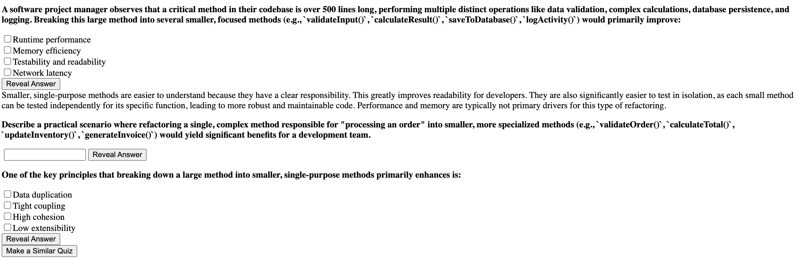

# Canvas Quiz Synthesizer

## Features 

- Retake **completed** quizzes
- Recieve **AI hints** to solve questions
- Generate **similar quizzes** with answer keys
- Download **quizzes**
- Only functional for **COMPLETED** quizes. ***No Cheating!***

## Obtaining a Gemini key 
Google offers a **FREE** API key that can be obtained from [Google AI Studio](https://aistudio.google.com/). This key is limited though offers generous use of the Gemini models for free!

## Problem Space
Canvas quizzes are sometimes not able to be retaken due to permissions retracted by instructors. Retaking old quizzes can be a good excercise to refresh old topics and test your knowledge. When retake permissions are retracted, students may be able to see correct and old answers. The current solutions to this problem are to manually copy and paste questions and answers.

## Solution
Canvas Quiz Synthesizer abstracts away the manual process of rewriting quizzes by scraping questions and options for students. Students get options to extract questions by the questions' types(MCQ, Short Answer, All) and then can recieve AI hints to help solve problems if needed. They are also provided with the option to generate similar quizzes.

## How do I use Canvas Quiz Synthesizer
1. Download the extension from Git or chrome store
2. Navigate to a Canvas Quiz
3. Click on the extention and set your Gemini API Key(optional)
4. Click on the extention and choose one of the Extract Options
5. Answer Away!

## Limitations
- Gemini API Key needed for AI features
- Only functional for **Completed quizes**. No Cheating!
- Some question types may be malformed or not supported(Matching Questions)

