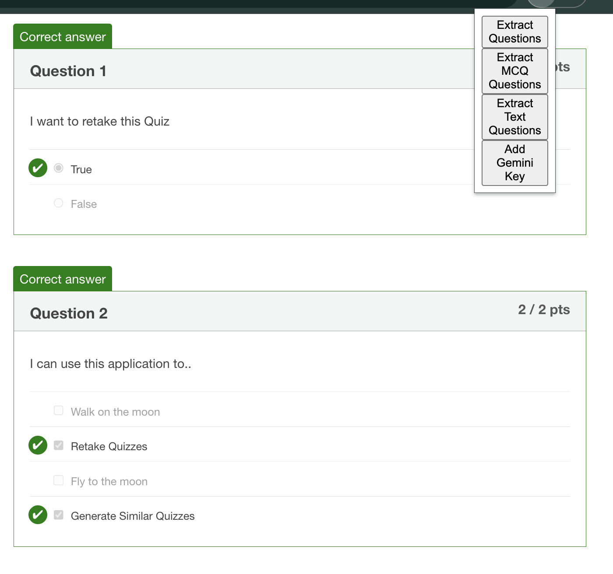
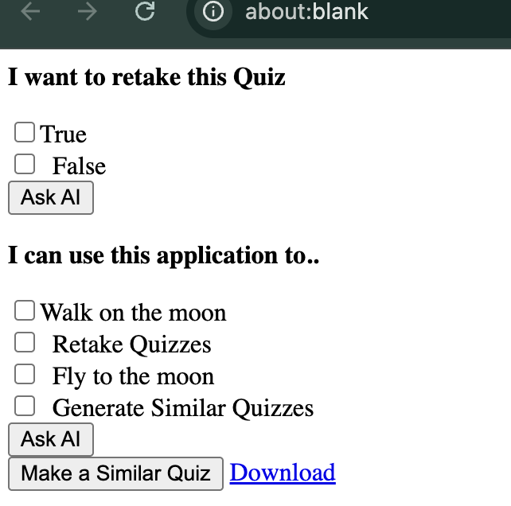
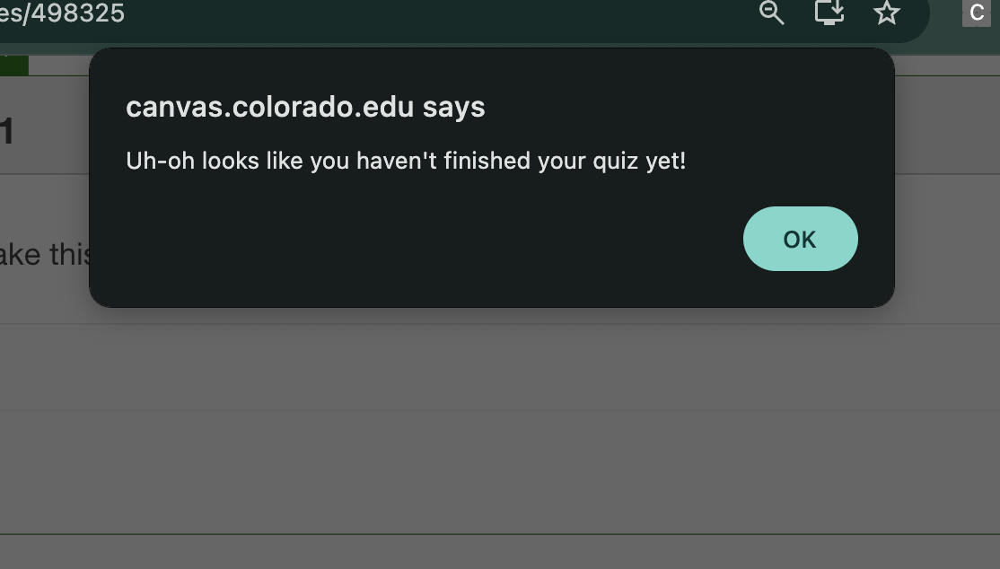

# Canvas Quiz Synthesizer

## Features 

- Retake **completed** quizzes
- Recieve **AI hints** to solve questions
- Generate **similar quizzes**
- Download **quizzes**

## Problem Space
Canvas quizzes are sometimes not able to be retaken due to permissions retracted by instructors. Retaking old quizzes can be a good excercise to refresh old topics and test your knowledge. When retake permissions are retracted, students may be able to see correct and old answers. The only current solutions to this problem are to manually copy and paste questions and answers or cover up old answer.

## Solution
Canvas Quiz Synthesizer abstracts away the manual process of rewriting quizzes by scraping questions and options for students. Students get options to extract questions by the questions' types(MCQ, Short Answer, All) and then can recieve AI hints to help solve problems if needed. They are also provided with the option to generate similar quizzes.

## Limitations
- Only functional for **Completed quizes**. No Cheating!
- Some question types may be malformed or not supported(Matching Questions)

